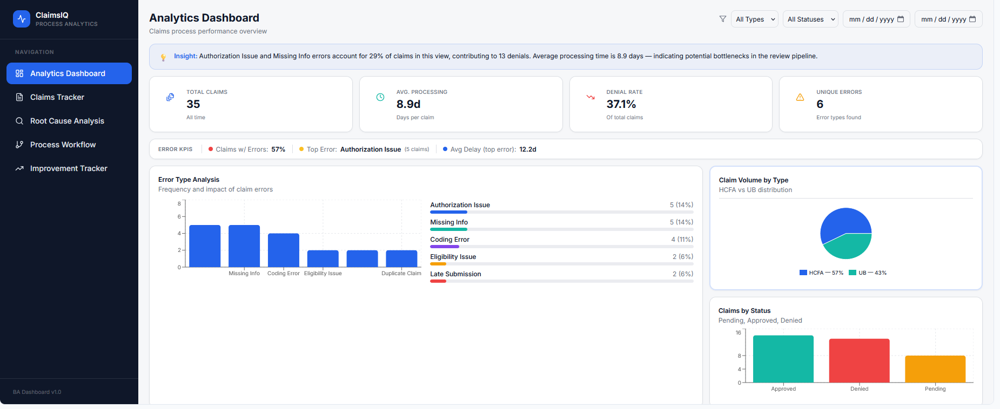
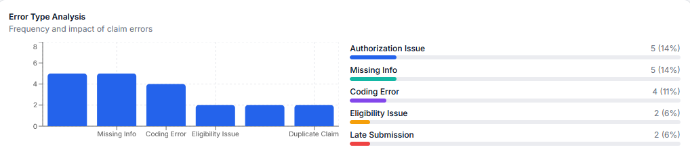
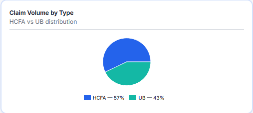
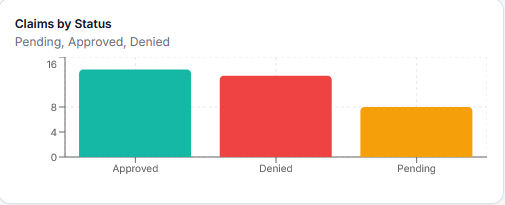
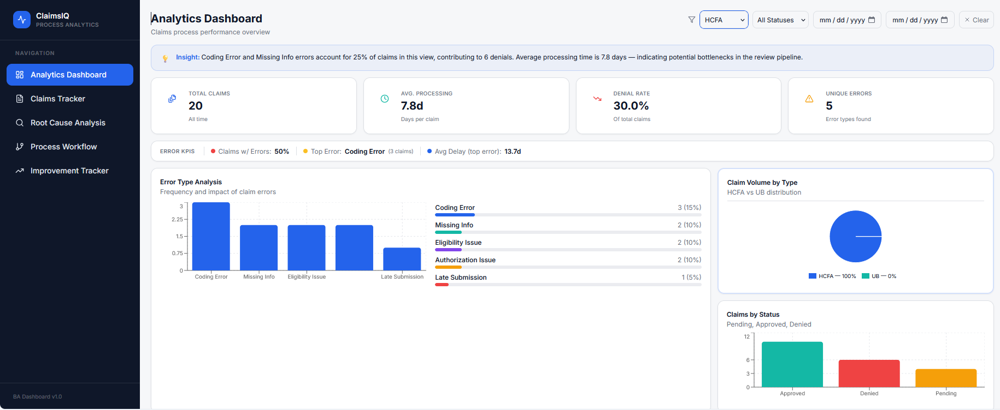

# 🏥 ClaimsIQ – Business Analyst Process Optimization Dashboard

## 📌 Overview
ClaimsIQ is an interactive analytics dashboard designed to simulate how a Business Analyst identifies inefficiencies in claims processing workflows.

This application leverages data visualization, process analysis, and Lean Six Sigma principles to uncover bottlenecks, track performance, and provide actionable insights for operational improvement.

---

## 🎯 Objective
The goal of this project is to demonstrate real-world Business Analyst capabilities, including:

- 📊 Data analysis & visualization  
- 🔍 Root cause analysis  
- 🔄 Process improvement (Lean Six Sigma - DMAIC)  
- 📈 Performance tracking & KPI monitoring  
- 🧠 Translating data into business insights  

---

## ⚙️ Key Features

- 📊 **KPI Dashboard** – Tracks total claims, processing time, denial rate, and error types  
- 🔍 **Error Analysis Module** – Identifies and ranks the most frequent processing issues  
- 📈 **Claims Distribution** – Visualizes claim types and workload distribution  
- 📉 **Status Tracking** – Monitors claim outcomes (Approved, Denied, Pending)  
- 🧠 **Insight Generation** – Highlights key operational inefficiencies  
- 🎛️ **Interactive Filters** – Allows dynamic analysis by claim type, status, and date  

---

## 📸 Dashboard Preview

### 🧭 Overview

This view provides a high-level summary of claims processing performance.  
It includes key metrics, insight generation, and a consolidated view of operational health, allowing stakeholders to quickly assess system performance.

---

### 💡 Insights & KPIs

This section highlights critical performance indicators such as total claims, average processing time, denial rate, and unique error types.  
The insight banner translates raw data into actionable business intelligence, identifying key contributors to inefficiencies.

---

### 📊 Error Analysis

The error analysis module identifies the most frequent claim processing issues and their impact.  
This supports root cause analysis by highlighting patterns such as authorization issues and missing information, enabling targeted process improvements.

---

### 🥧 Claim Distribution

This visualization breaks down claim volume by type (HCFA vs UB), helping stakeholders understand workload distribution and identify potential imbalances in processing demand.

---

### 📉 Status Breakdown

This section tracks claim outcomes across Approved, Denied, and Pending statuses.  
It provides visibility into operational effectiveness and helps identify areas where claim success rates can be improved.

---

### 🎛️ Filtered View

The dashboard includes interactive filters that allow users to dynamically adjust the dataset.  
This enables deeper analysis by isolating specific claim types, statuses, or time ranges—simulating real-world Business Analyst workflows.

---

## 🧠 Business Impact

This solution demonstrates how data can be used to:

- Identify high-impact error drivers (e.g., Authorization Issues, Missing Information)  
- Detect process bottlenecks in claims workflows  
- Improve decision-making through data-driven insights  
- Support continuous improvement initiatives  

---

## 🛠️ Tools & Concepts Used

- Base44 (Application Development Platform)  
- Data Visualization (Power BI / Tableau-inspired design)  
- Lean Six Sigma (DMAIC methodology)  
- Business Analysis Principles (requirements, process mapping, insight generation)  

---

## 🚀 Key Takeaway

ClaimsIQ showcases the ability to bridge the gap between business operations and technical systems by transforming raw data into actionable insights that drive efficiency and performance improvements.

This project reflects real-world Business Analyst thinking—focused not just on data, but on delivering measurable business value.
